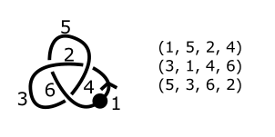

# Applying Machine Learning to Knot Diagram Reduction

## Principal Investigator: Dr. Deniz Kutluay

We are interested in the implementation of software in Python for locally moving knot diagrams so that we can apply machine learning to algorithmically untangle knots.

# Topological Data Analysis in Stock Market Data

## Principal Investigator: Mario Cicchinelli

We are interested in the application of topological data analysis in analyzing trends in stock market. Our goal is to effectively predict crashes in the stock market via an early warning system (EWS).